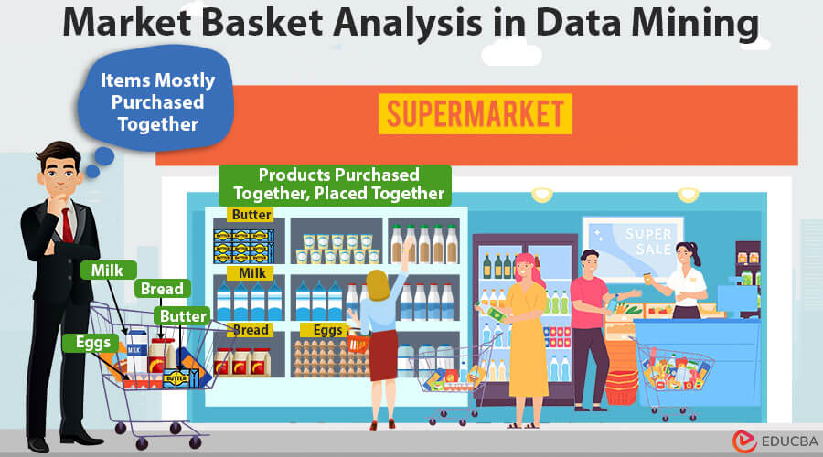

# Market-basket-Analysis-Project
This project demonstrates Market Basket Analysis using PostgreSQL, Python, and Apriori algorithm.This project objective is to identify associations and purchasing patterns between products in a retail store’s transactional dataset. By analyzing which items are frequently bought together, businesses can make data-driven decisions to optimize product placement, cross-selling, and marketing strategies.

# Apriori Algorithm for Data Mining

## Project Highlights

- Data storage and retrieval using PostgreSQL
- Transaction preprocessing and one-hot encoding
- Frequent itemset generation using Apriori
- Association rules extraction
- Visualizations (frequent items, rule scatter plot, heatmap)
- Insights and business recommendations

## File Structure

- `final_transactions.csv` : Sample transactions data
- `market_basket_analysis.ipynb` : Jupyter Notebook with full analysis

## Key Insights

* Most popular items: **Milk, Bread, Diaper**
* Strong association rules such as:

  * `Diaper -> Beer`
  * `Bread + Milk -> Butter`
* High-support items indicate products that sell frequently and should be stocked consistently.
* High-lift association rules suggest items that are often bought together and can be used for promotional bundles or product placement strategies.

## Conclusion

Market Basket Analysis allows businesses to understand purchasing patterns and optimize sales strategies. This project demonstrates the complete workflow from **data extraction** (PostgreSQL) to **analysis** (Python & Apriori) and **insights**. Retailers can leverage these findings to improve product placement, create bundled offers, and enhance customer experience.

---

This repository serves as a **portfolio project** demonstrating data engineering, data analysis, and machine learning skills with real transactional data.

